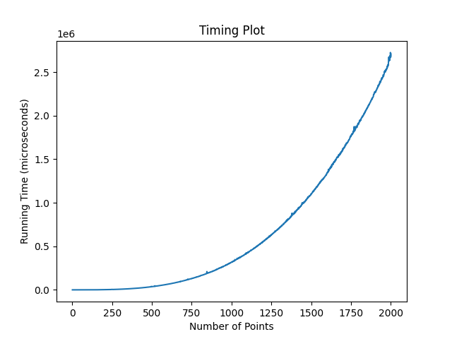
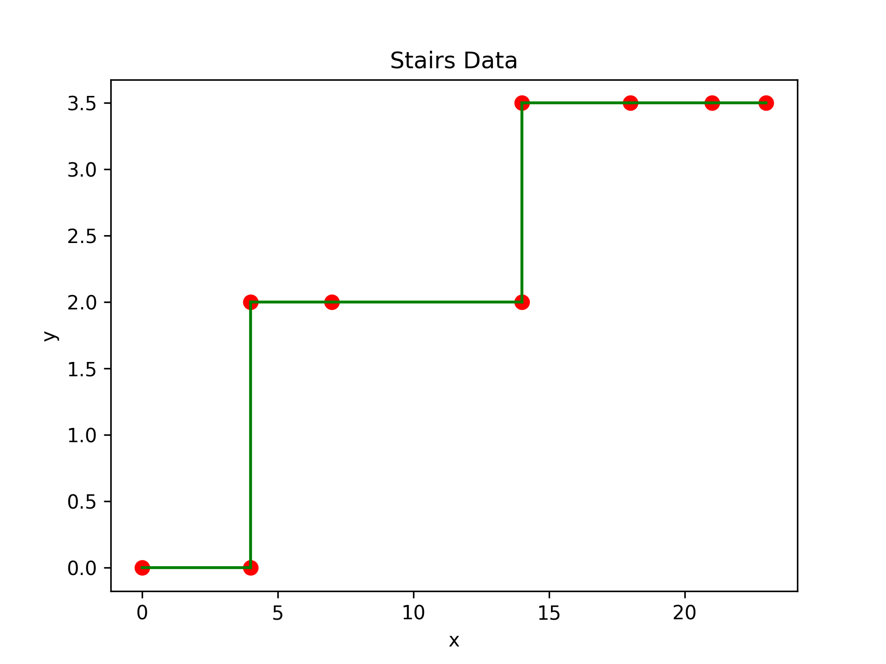
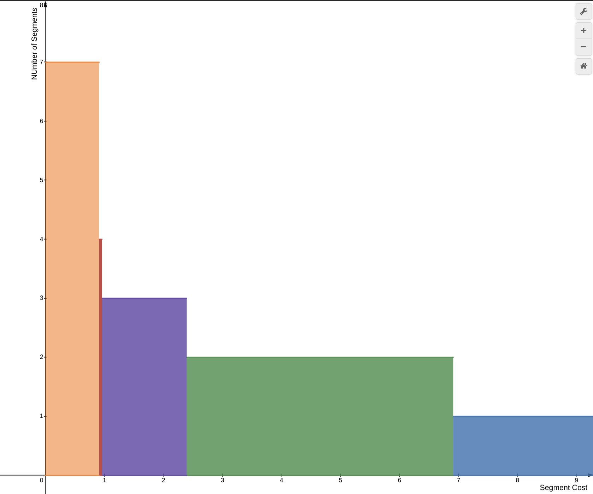

# Segmented Least Squares

Segmented Least Squares is a dynamic programming algorithm used to find the best fit line for a set of points that are divided into different segments. 

The algorithm divides the points into segments and then calculates the line of best fit for each segment, such that the sum of squared distances between the line and the points is minimized, while also taking into account the cost of creating new segments. This approach allows for a more accurate and efficient way of fitting data that has multiple trends or patterns.

## Algorithm

Given a set $P$ of $n$ points in the plane, denoted $(x_1, y_1), (x_2, y_2), …, (x_n, y_n)$ with  $x_1 < x_2 < …< x_n$ and a line $L$ defined by the equation $y = ax + b$, the error wrt $P$ is sum of the its squared distances to the points in $P$:
$$Err(L, P) = \sum_{i=1}^{n} {(y_i -ax_i - b)}^2$$
$$a = \frac{n \sum_{i=1}^{n} {x_iy_i} - (\sum_{i=1}^{n} x_i)(\sum_{i=1}^{n} y_i)}{n\sum_{i=1}^{n} x_i^2 - (\sum_{i=1}^{n} x_i)^2}$$
$$b = \frac {\sum_{i=1}^{n} y_i - a\sum_{i=1}^{n} x_i}{n}$$

Let $OPT(i)$ be the optimal value for the points $p_1, p_2, …, p_i$ and $e_{i,j}$ denote the minimum error of any line through $p_i, p_{i+1}, …, p_j$.  Since $i$ and $j$ can take only distinct values, the recurrence relation is:

$$OPT(j) = \min_{1\le i \le j}  e_{i,j} + C + OPT(i-1)$$

> $C$ is the cost of making a single segment.

## Time Complexity

The time complexity of the Segmented Least Squares algorithm depends on the number of data points i.e. $N$ and the number of segments created. In general, the algorithm has a time complexity of $\mathcal{O}(N^3)$ as a consequence of calculating the value of $e_{i,j}$ over all $1 \le i \le j \le n$.

However, after computing the values of $e_{i,j}$, computing the values of $OPT(j)$ takes $\mathcal{O}(N^2)$ time using the aforementioned recurrence relation.

Overall, the time complexity of the Segmented Least Squares algorithm makes it well-suited for moderate-sized datasets, but may not be practical for very large datasets or real-time applications.

## Example
Consider the following points, which trace out a stair pattern,

| #   | x   | y   |
| --- | --- | --- |
| 0   | 0   | 0   |
| 1   | 4   | 0   |
| 2   | 4   | 2   |
| 3   | 7   | 2   |
| 4   | 14  | 2   |
| 5   | 14  | 3.5 |
| 6   | 18  | 3.5 |
| 7   | 21  | 3.5 |
| 8   | 23  | 3.5 |
| 9   | 23  | 1.5 |
| 10  | 27  | 1.5 |
| 11  | 34  | 1.5 |
 

For different values of segment cost:

| number_of_segment | lower_limit | upper_limit |
| ----------------- | ----------- | ----------- |
| 1                 | 6.9095      | -           |
| 2                 | 2.3931      | 6.9094      |
| 3                 | 0.9568      | 2.3930      |
| 4                 | 0.9090      | 0.9567      |
| 5                 | 0.2230      | 0.9085      |
| 6                 | 0.0007      | 0.2225      |
| 7                 | 0.0000      | 0.0006      |

