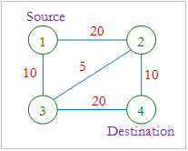
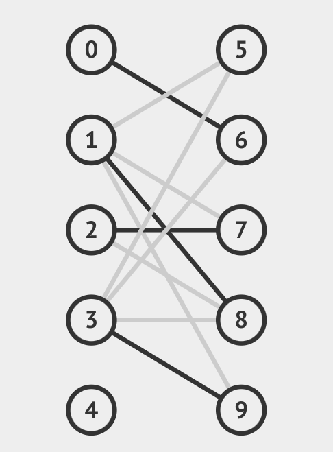
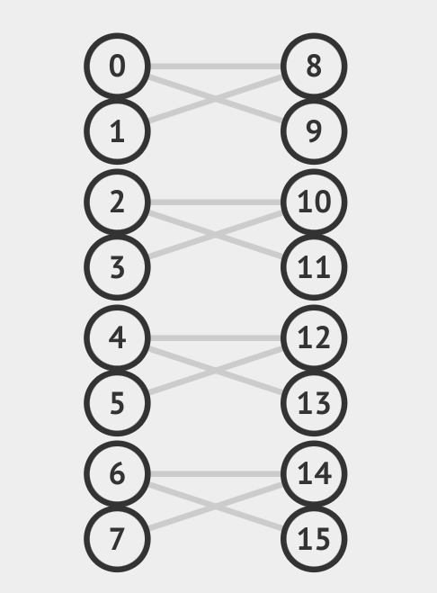

# Ford Fulkerson

The Ford-Fulkerson algorithm is used to find the maximum flow possible in a graph. In each iteration, we find an augmenting path, and increase the flow on the edges of that path by the bottleneck residual capacity. We repeat this process till no more augmenting paths can be found, at which stage we conclude that maximum flow has been achieved on the graph.

# Network Flow: Sample Run

We have tested the Ford-Fulkerson implementation on the following test cases:

## Test Case 1:

```
4 5
1 2 20
1 3 10
2 3 5
2 4 10
3 4 20
```



The time taken was `48` $\mu s$.

## Test Case 2:

This was a bigger test case with $n = 100$, $m = 1000$ and $C = 10,000$.

The original test case can be found here: https://onlinejudge.u-aizu.ac.jp/problems/GRL_6_A

The time taken was `4.69` $s$.

# Bipartite Matching: Sample Runs

We have tested the application of Ford-Fulkerson in bipartite matching through the following test cases:

## Test Case 1:

```
10 11
1 7 
2 6 
2 8 
2 9 
2 10 
3 8 
3 9 
4 6 
4 7 
4 9 
4 10
```



The time taken was `311` $\mu s$.

## Test Case 2:

```
16 12
1 9 
1 10 
2 9 
3 11 
3 12 
4 11 
5 13 
5 14 
6 13 
7 15 
7 16 
8 15
```



The time taken was `585` $\mu s$.

# Time Complexity

In our implementation, we have used an ordered map of sets to store the adjacency list information, and a map of pairs to store the capacity information. This allows us to lookup if a vertex is adjacent to a node in $\mathcal{O}(\log{m})$. Lookups to find the capacity of an edge is also $\mathcal{O}(\log{m})$. 

In each iteration, building the residual graph and finding the augmenting path can take $\mathcal{O}(m \cdot \log{m})$ in the worst case. Since the edges in the residual graph all have weights greater than zero, we can say that the bottleneck residual capacity is greater than zero. Thus, the total flow increases by at-least $1$ unit in every iteration. Since the max-flow is upper-bounded by the total capacity $C$ out of the source, the algorithm will terminate in atmost $C$ iterations. Hence in the worst case, the time complexity is $\mathcal{O}(m \cdot C \cdot \log m)$. 
