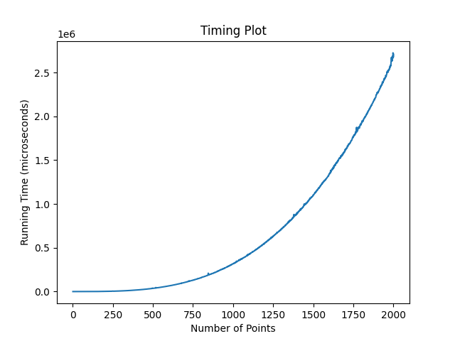
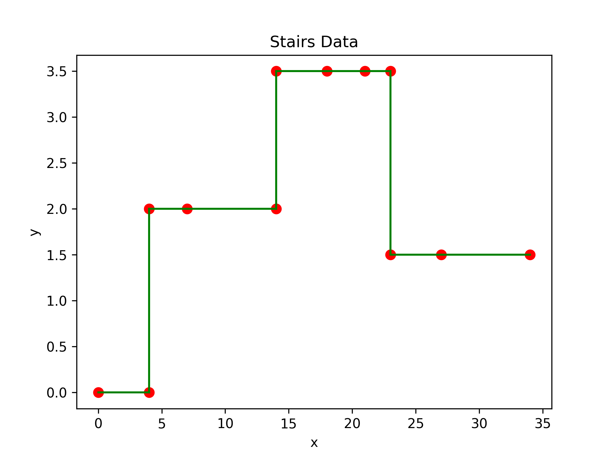
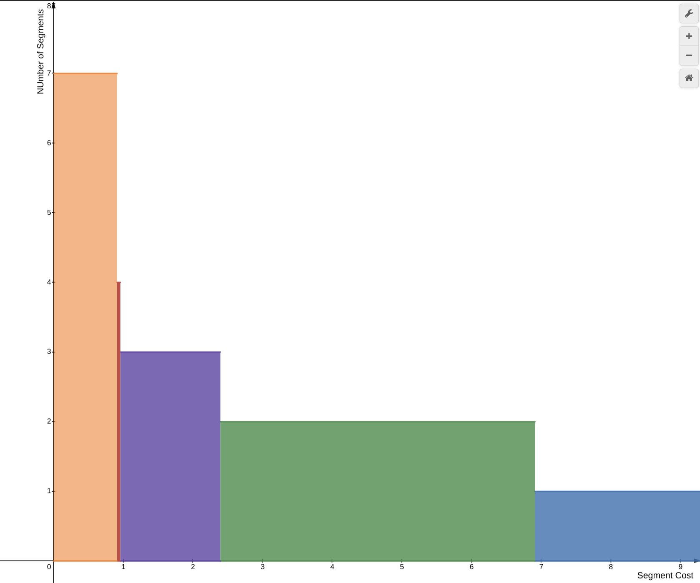

# DAA Assignment 2: Report

## Authors

Ashwin Arun - **2020A7PS1291H**

Kavyanjali Agnihotri - **2020A7PS0185H**

Tushar Chenan - **2022A7PS0253H**

## Introduction

Our report consists of two sections:

1. Ford-Fulkerson and Bipartite Matching
2. Least Segmented Squares - Dynamic Programming

# Ford-Fulkerson and Bipartite Matching

The Ford-Fulkerson algorithm is used to find the maximum flow possible in a graph. In each iteration, we find an augmenting path, and increase the flow on the edges of that path by the bottleneck residual capacity. We repeat this process till no more augmenting paths can be found, at which stage we conclude that maximum flow has been achieved on the graph.

## Network Flow: Sample Run

We have tested the Ford-Fulkerson implementation on the following test cases:

### Test Case 1:

```
4 5
1 2 20
1 3 10
2 3 5
2 4 10
3 4 20
```


The time taken was `48` $\mu s$.

### Test Case 2:

This was a bigger test case with $n = 100$, $m = 1000$ and $C = 10,000$.

The original test case can be found here: https://onlinejudge.u-aizu.ac.jp/problems/GRL_6_A

The time taken was `4.69` $s$.

## Bipartite Matching: Sample Runs

We have tested the application of Ford-Fulkerson in bipartite matching through the following test cases:

### Test Case 1:

```
10 11
1 7 
2 6 
2 8 
2 9 
2 10 
3 8 
3 9 
4 6 
4 7 
4 9 
4 10
```


The time taken was `311` $\mu s$.

### Test Case 2:

```
16 12
1 9 
1 10 
2 9 
3 11 
3 12 
4 11 
5 13 
5 14 
6 13 
7 15 
7 16 
8 15
```


The time taken was `585` $\mu s$.

## Time Complexity

In our implementation, we have used an ordered map of sets to store the adjacency list information, and a map of pairs to store the capacity information. This allows us to lookup if a vertex is adjacent to a node in $\mathcal{O}(\log{m})$. Lookups to find the capacity of an edge is also $\mathcal{O}(\log{m})$. 

In each iteration, building the residual graph and finding the augmenting path can take $\mathcal{O}(m \cdot \log{m})$ in the worst case. Since the edges in the residual graph all have weights greater than zero, we can say that the bottleneck residual capacity is greater than zero. Thus, the total flow increases by at-least $1$ unit in every iteration. Since the max-flow is upper-bounded by the total capacity $C$ out of the source, the algorithm will terminate in atmost $C$ iterations. Hence in the worst case, the time complexity is $\mathcal{O}(m \cdot C \cdot \log m)$. 

# Segmented Least Squares

Segmented Least Squares is a dynamic programming algorithm used to find the best fit line for a set of points that are divided into different segments. 

The algorithm divides the points into segments and then calculates the line of best fit for each segment, such that the sum of squared distances between the line and the points is minimized, while also taking into account the cost of creating new segments. This approach allows for a more accurate and efficient way of fitting data that has multiple trends or patterns.

## Algorithm

Given a set $P$ of $n$ points in the plane, denoted $(x_1, y_1), (x_2, y_2), …, (x_n, y_n)$ with  $x_1 < x_2 < …< x_n$ and a line $L$ defined by the equation $y = ax + b$, the error wrt $P$ is sum of the its squared distances to the points in $P$:
$$Err(L, P) = \sum_{i=1}^{n} {(y_i -ax_i - b)}^2$$
$$a = \frac{n \sum_{i=1}^{n} {x_iy_i} - (\sum_{i=1}^{n} x_i)(\sum_{i=1}^{n} y_i)}{n\sum_{i=1}^{n} x_i^2 - (\sum_{i=1}^{n} x_i)^2}$$
$$b = \frac {\sum_{i=1}^{n} y_i - a\sum_{i=1}^{n} x_i}{n}$$

Let $OPT(i)$ be the optimal value for the points $p_1, p_2, …, p_i$ and $e_{i,j}$ denote the minimum error of any line through $p_i, p_{i+1}, …, p_j$.  Since $i$ and $j$ can take only distinct values, the recurrence relation is:

$$OPT(j) = \min_{1\le i \le j}  e_{i,j} + C + OPT(i-1)$$

> $C$ is the cost of making a single segment.

## Time Complexity

The time complexity of the Segmented Least Squares algorithm depends on the number of data points i.e. $N$ and the number of segments created. In general, the algorithm has a time complexity of $\mathcal{O}(N^3)$ as a consequence of calculating the value of $e_{i,j}$ over all $1 \le i \le j \le n$.

However, after computing the values of $e_{i,j}$, computing the values of $OPT(j)$ takes $\mathcal{O}(N^2)$ time using the aforementioned recurrence relation.



Overall, the time complexity of the Segmented Least Squares algorithm makes it well-suited for moderate-sized datasets, but may not be practical for very large datasets or real-time applications.

## Sample Runs

Consider the following points, which trace out a stair pattern,

| #   | x   | y   |
| --- | --- | --- |
| 0   | 0   | 0   |
| 1   | 4   | 0   |
| 2   | 4   | 2   |
| 3   | 7   | 2   |
| 4   | 14  | 2   |
| 5   | 14  | 3.5 |
| 6   | 18  | 3.5 |
| 7   | 21  | 3.5 |
| 8   | 23  | 3.5 |
| 9   | 23  | 1.5 |
| 10  | 27  | 1.5 |
| 11  | 34  | 1.5 |
 


For different values of segment cost:

| number_of_segment | lower_limit | upper_limit |
| ----------------- | ----------- | ----------- |
| 1                 | 6.9095      | -           |
| 2                 | 2.3931      | 6.9094      |
| 3                 | 0.9568      | 2.3930      |
| 4                 | 0.9090      | 0.9567      |
| 5                 | 0.2230      | 0.9085      |
| 6                 | 0.0007      | 0.2225      |
| 7                 | 0.0000      | 0.0006      |


